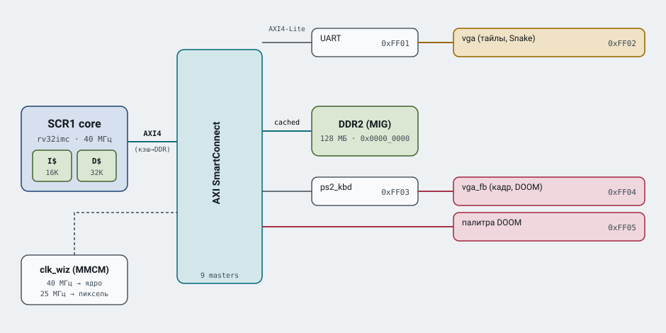
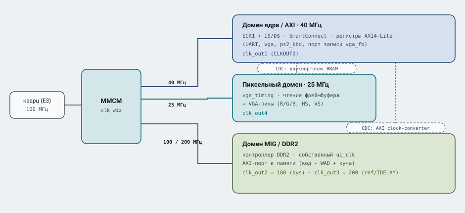
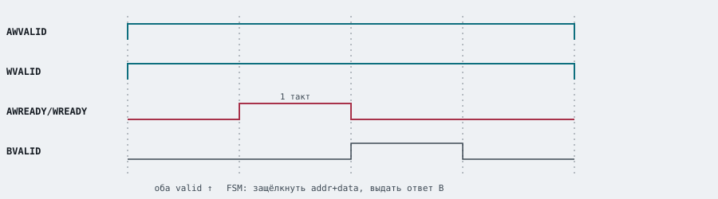
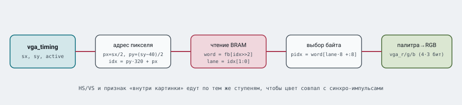
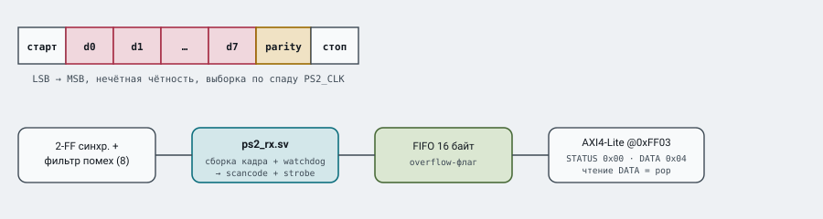
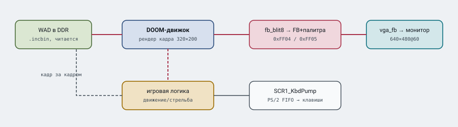

# Игровой SoC на SCR1 — архитектура и принцип работы (Snake и DOOM)

Подробный технический разбор: как подключены и как работают Snake и DOOM на ядре
**Syntacore SCR1** (rv32imc) на плате **Nexys A7-100T**. 

| | |
|---|---|
| **Ядро** | SCR1 rv32imc @ 40 МГц |
| **Кэш L1** | I$ 16 КиБ · D$ 32 КиБ (direct-mapped, линия 16 Б, write-through, no-write-allocate) |
| **ОЗУ** | DDR2 128 МБ через MIG |
| **Видео** | VGA 640×480@60 |
| **Ввод** | PS/2 set-2 |
| **Шина** | AXI4 (кэш-DDR) + AXI4-Lite (периферия), интерконнект SmartConnect |

---

## 1. Общая архитектура

Инструкции и данные из DDR идут через кэш; вся периферия — по облегчённой шине AXI4-Lite и не кэшируется, поэтому запись в регистр видна железу сразу.

*Рис. 1. Блок-схема SoC — [SVG](doc/figures/fig1_soc_block.svg) · [PNG](doc/figures/fig1_soc_block.png)*

---

## 2. Тактовые домены

На плате один кварц 100 МГц. Внутренний MMCM (`clk_wiz`) синтезирует все рабочие
частоты. В дизайне три асинхронных домена; переходы между ними сделаны через двухпортовую память и AXI-конвертер тактов.

*Рис. 2. Тактовые домены — [SVG](doc/figures/fig2_clock_domains.svg) · [PNG](doc/figures/fig2_clock_domains.png)*

| Домен | Частота | Источник | Что тактует |
|---|---|---|---|
| Ядро / AXI | 40 МГц | `clk_out1` (CLKOUT0) | SCR1, I$/D$, SmartConnect, все slave AXI4-Lite |
| Пиксель | 25 МГц | `clk_out4` | vga_timing, чтение кадра, выход на VGA-пины |
| MIG / DDR2 | ui_clk | `clk_out2`+`clk_out3` | контроллер DDR2 (sys 100 МГц + ref 200 МГц для IDELAY) |
| JTAG | ~10 МГц | внешний TCK (JC[3]) | отладочный интерфейс |

---

## 3. Карта памяти

Адрес однозначно выбирает получателя транзакции. Окно DDR кэшируется, окно
`0xFF0x_xxxx` — периферия, мимо кэша.

| Адрес | Блок | Назначение | Кэш |
|---|---|---|---|
| `0x0000_0000` | DDR2 (MIG) | Код + встроенный WAD + куча DOOM (128 МБ) | **cached** |
| `0xF000_0000` | TCM | Плотная память ядра: загрузчик, самотесты | bypass |
| `0xF004_0000` | Timer | Системный таймер платформы | bypass |
| `0xFF01_0000` | UART | Консоль + загрузка образа по XMODEM | bypass |
| `0xFF02_0000` | vga (тайлы) | Тайловый контроллер Snake (40×30 клеток) | bypass |
| `0xFF03_0000` | ps2_kbd | PS/2 клавиатура (обе игры) | bypass |
| `0xFF04_0000` | vga_fb | Пиксельный фреймбуфер DOOM 320×200×8bpp | bypass |
| `0xFF05_0000` | vga_fb | Аппаратная палитра DOOM (256×RGB444) | bypass |
| `0xFFFF_FF00` | reset vector | Точка старта ядра → загрузчик в bootrom | bypass |

---

## 4. AXI4-Lite

Каждая периферия - slave AXI4-Lite: канал записи адреса (AW), записи данных (W),
ответа (B) и симметрично чтение (AR/R). Рукопожатие — по паре `valid`/`ready`:
передача происходит в такте, где обе высоки.

*Рис. 3. Временна́я диаграмма записи AXI4-Lite (регистровый `ready`) — [SVG](doc/figures/fig3_axi_handshake.svg) · [PNG](doc/figures/fig3_axi_handshake.png)*

**Реальный баг .** Изначально `awready`/`wready` зависели
*комбинаторно* от `awvalid`/`wvalid`. С SmartConnect это замкнуло путь
`valid→ready→valid` в одном такте и **портило AWADDR — все записи попадали в ячейку 0**
Решение: небольшой FSM (`W_IDLE→W_RESP`), который
защёлкивает адрес и данные и отдаёт `ready` одиночным регистровым импульсом.
Приём применён во всех трёх slave: `vga`, `vga_fb`, `ps2_kbd`.

---

## 5. Две видеоподсистемы: тайлы vs фреймбуфер

порт A — такт ядра/AXI, порт B — пиксельный клок 25 МГц.

| | **Snake — тайлы** (`vga_ctrl.sv`, 0xFF02) | **DOOM — фреймбуфер** (`vga_fb.sv`, 0xFF04) |
|---|---|---|
| Организация | сетка 40×30 клеток по 16×16 px → 640×480 | кадр 320×200, 8 бит/пиксель |
| Хранение | 1 слово/клетка, младшие 4 бита = индекс; 2048 клеток (8 КБ) | 4 пикселя в 32-битном слове; 16000 слов |
| Палитра | фиксированная (16 цветов) | аппаратная 256×RGB444, грузится в рантайме |
| Вывод | клетка -> палитра -> пиксель | 320×200 удваивается до 640×400, центр (полосы 40 px) |
| Трафик/кадр | единицы слов | 62,5 КБ из DDR |

### Конвейер вывода пикселя (DOOM)

На каждом пиксельном такте контроллер считает, какой пиксель кадра сейчас на луче, достаёт слово из BRAM, вынимает нужный байт-индекс и превращает его в цвет через палитру.

*Рис. 4. Конвейер вывода пикселя `vga_fb.sv` — [SVG](doc/figures/fig4_pixel_pipeline.svg) · [PNG](doc/figures/fig4_pixel_pipeline.png)*

### Генератор синхронизации VGA

Общий модуль `vga_timing.sv` задаёт стандарт **640×480@60** (пиксельклок 25 МГц).
Горизонталь: 640 видимых + 16 front + 96 sync + 48 back = **800**; вертикаль:
480 + 10 + 2 + 33 = **525** строк. `HS`/`VS` активны низким уровнем. Модуль
продвигается на один пиксель за каждый такт, где поднят `pix_ce` — тот же код работает
и на 100 МГц с делением на 4 (стенд), и на 25 МГц напрямую (SoC).

---

## 6. Ввод: PS/2-клавиатура

Клавиатура - ведущий по своим линиям: сама генерит `PS2_CLK` (~10-16 кГц) и данные.
Кадр PS/2 - 11 бит: старт(0), 8 бит данных (младшим вперёд), бит нечётной чётности, стоп(1). Данные достоверны по спаду `PS2_CLK`.

*Рис. 5. Кадр PS/2 и путь пин → FIFO → AXI — [SVG](doc/figures/fig5_ps2_keyboard.svg) · [PNG](doc/figures/fig5_ps2_keyboard.png)*

---

## 7. Программный тракт DOOM

Порт `doomgeneric` без ОС, bare-metal. Движок оставлен стоковым; под железку написан тонкий платформенный слой (`doomgeneric_scr1.c`) и два хука в `i_video.c`.

**Вывод кадра и палитры:**
- DOOM рисует в 8-битный экран 320×200 (индексы палитры).
- Хук `I_FinishUpdate` - `SCR1_FinishUpdate()` - `fb_blit8()`: копирует весь кадр в `0xFF04_0000` по 4 пикселя/слово.
- Хук `I_SetPalette` - `SCR1_SetPaletteEntry()`: пишет 256 записей `0x00RRGGBB` в `0xFF05_0000` (железо берёт старший ниббл каждого канала → RGB444).

**Ввод и время:**
- `SCR1_KbdPump()` читает FIFO PS/2, разбирает префиксы `0xE0` (extended) и `0xF0` (отпускание), мапит скан-коды в клавиши DOOM.
- WASD/стрелки — движение, Ctrl — огонь, Space — «использовать», Shift — бег, Z/X — стрейф.
- Тайминг: `DG_GetTicksMs`/`DG_SleepMs` из `rdcycle` и `SYS_CLK=40 МГц`
  (константа 40000 тактов/мс зашита в бинарь).

*Рис. 6. Главный цикл: рендер → блит в фреймбуфер → вывод; параллельно PS/2 кормит ввод — [SVG](doc/figures/fig6_doom_loop.svg) · [PNG](doc/figures/fig6_doom_loop.png)*

**WAD.** `doom1.wad` (shareware, ~4 МБ) встраивается в бинарь через `wad_blob.S`
(`.incbin`) как rodata-блоб; `syscalls_doom.c` обслуживает `open/read/lseek` из этого
блоба — файловой системы нет.

---

## 8. Производительность: кэш и частота

**Тактовая частота** 30 -> **40 МГц** (timing MET, запас тонкий ~+0,19 нс):
- согласовано в 4 местах: `clk_wiz`, ограничение `CPU_CLK_VIRT`,
  `SCR1_PTFM_CORE_CLK_FREQ`, `SYS_CLK` в софте;
- `SYS_CLK` обязан совпадать с реальной частотой — иначе «время» в игре поплывёт;
- для закрытия тайминга включён `phys_opt` (pre- и post-route).

---

## 9. FPS: измерено на плате

Счётчик кадров добавлен в `SCR1_FinishUpdate` (сборка `make doom DOOM_FPS=1`): раз в
секунду в UART печатается `[FPS] xx.x`. **Реальный замер** на текущей конфигурации
(**I$ 16 КиБ / D$ 32 КиБ · 40 МГц**), уровень E1M1:

| Сцена | FPS (замер на плате) |
|---|---|
| Стоя на месте | **~4** |
| Стрельба / активное движение | **~2** |

