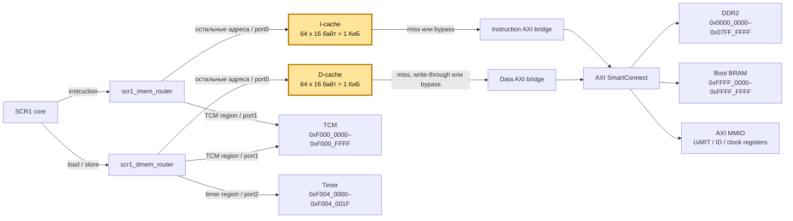

# SCR1 caches

Кэши инструкций и данных для SCR1 в проекте Nexys 4 DDR. Оба кэша находятся
после адресных роутеров и перед AXI-мостами. Поэтому TCM и timer обслуживаются
напрямую, а проходящий через `port0` трафик сначала поступает в соответствующий
кэш.

## Возможности

- direct-mapped, blocking;
- строка 16 байт: 4 слова по 32 бита;
- последовательный fill всей строки;
- синхронные одномерные массивы с `ram_style = "block"`;
- I-cache: по умолчанию 64 строки, 1 КиБ, настраиваемый объём;
- D-cache: по умолчанию 64 строки, 1 КиБ, настраиваемый объём;
- D-cache: write-through, no-write-allocate, byte-enable для частичных stores;
- TCM обходит оба кэша на уровне роутеров;
- timer обходит D-cache на уровне `dmem_router`;
- boot BRAM и внешние MMIO проходят через cache bypass;
- invalidate I-cache и flush D-cache.

## Архитектура



Жёлтым выделены кэши. Роутеры стоят перед ними и сразу отделяют внутренние
устройства. В результате:

```text
TCM instruction/load/store → router → TCM
timer load/store           → dmem_router → timer
DDR2                       → router port0 → cache → AXI → DDR2
boot BRAM и AXI MMIO       → router port0 → cache bypass → AXI
```

## Файлы

| Файл | Назначение |
|---|---|
| [`scr1_icache.sv`](./scr1_icache.sv) | Кэш инструкций |
| [`scr1_dcache.sv`](./scr1_dcache.sv) | Кэш данных |
| [`scr1_cache_wrapper.sv`](./scr1_cache_wrapper.sv) | Общая обёртка и соединение интерфейсов |
| [`CACHE_IMPLEMENTATION_RU.md`](./CACHE_IMPLEMENTATION_RU.md) | Подробное описание архитектуры, FSM и сигналов |

Интеграция выполнена в
[`scr1_top_axi.sv`](../../../../../scr1/src/top/scr1_top_axi.sv), а файлы включены
в [`nexys4ddr_scr1.xpr`](../../nexys4ddr_scr1/nexys4ddr_scr1.xpr).

## Текущая конфигурация

| Кэш | Строк | Размер строки | Ёмкость данных | Cacheable |
|---|---:|---:|---:|---|
| I-cache | 64 | 16 байт | 1 КиБ | DDR2 `0x0000_0000–0x07FF_FFFF` |
| D-cache | 64 | 16 байт | 1 КиБ | DDR2 `0x0000_0000–0x07FF_FFFF` |

```systemverilog
.ICACHE_ADDR_MASK     (32'hF800_0000),
.ICACHE_ADDR_PATTERN  ('0),
.DCACHE_ADDR_MASK     (32'hF800_0000),
.DCACHE_ADDR_PATTERN  ('0)
```

Маска `0xF800_0000` проверяет пять старших битов адреса. Нулевой pattern
выбирает ровно 128 МиБ DDR2: `0x0000_0000–0x07FF_FFFF`. Остальные адреса,
пришедшие через `port0`, обслуживаются cache bypass. MMIO нельзя добавлять в
cacheable-диапазон D-cache.

## Политики

I-cache принимает только чтения. При miss он последовательно загружает четыре
слова и выставляет valid только после полного fill.

D-cache обслуживает load hit локально. Каждый store отправляется нижней памяти;
после успешного store hit cached copy обновляется через byte-enable. Store miss
не загружает строку.

Массивы data/tag не сбрасываются — reset очищает valid-биты. В текущем
`scr1_top_axi` входы runtime invalidate/flush подключены к `1'b0`, поэтому
обслуживание кэшей доступно только внутри модулей, но пока не управляется ядром.

## Ограничения

- один запрос одновременно;
- четыре одиночных чтения на fill, без burst и early restart;
- нет ассоциативности, prefetch и write buffer;
- нет аппаратной когерентности I-cache/D-cache/DMA;
- runtime invalidate/flush не подключены в top.

## Версии

### cache_1.2 — роутеры перед кэшами

- `imem_router` подключён напрямую к instruction-интерфейсу ядра;
- TCM-инструкции уходят с `port1` в TCM, минуя I-cache;
- `dmem_router` подключён напрямую к data-интерфейсу ядра;
- TCM и timer уходят с `port1`/`port2`, минуя D-cache;
- `port0` каждого роутера подключён к кэшу, а нижняя сторона кэша — к AXI;
- I-cache переведён на одну основную пару `ADDR_MASK/ADDR_PATTERN`, общую по
  смыслу с D-cache.

### cache_1.0 — базовая версия

Варианты отличаются только размерами кэшей и используют одинаковую базовую
архитектуру:

- `i1k_d1k`;
- `i16k_d1k`;
- `i32k_d1k`;
- `i1k_d4k`;
- `i1k_d16k`;
- `i32k_d16k`.

## Бенчмарки

Результаты бенчмарков представлены в
[таблице](https://docs.google.com/spreadsheets/d/1Z09Oc5KWd_BYFXryHQR0jsfkYbIVZM1zehx1FCA-16o/edit?usp=sharing).
