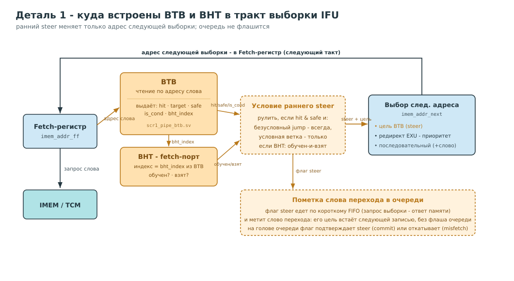
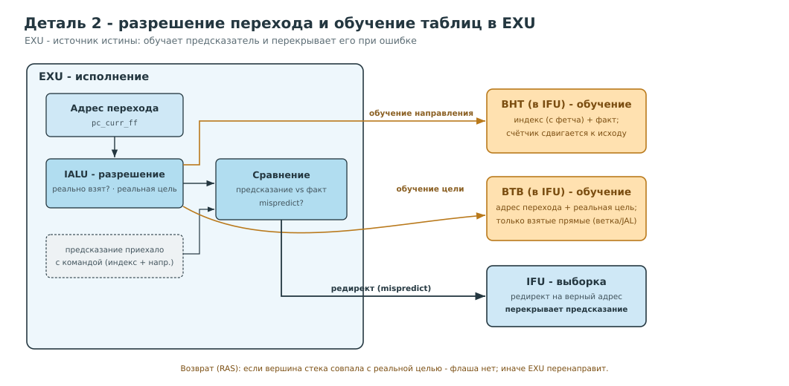

# Предсказатель переходов для SCR1 (RV32IMC, 3-ступенчатый конвейер)

> TL;DR. К штатному ядру добавлены четыре структуры -**BTB** (кэш целей),
> **BHT** (направление), **BTFN** (статический базовый слой) и **RAS** (возвраты).
> Предсказание делается в двух точках, обучается из ступени исполнения, корректность  восстанавливает EXU.

---

## Конвейер SCR1 с предсказателем


**Две точки предсказания:**
- **Рано** -`BTB` читается по адресу выборки `imem_addr_ff` (до декода) и
  меняет  следующий адрес выборки, без флаша очереди, т.е. убирает «пузырь взятого перехода» прямо на этапе выборки. Направление раннего steer'а подтверждает `BHT` через второй порт чтения (fetch-side гейт).
- **Поздно** - на голове очереди (`ifu_head_pc`) работают `BTFN` (цель `PC+imm` +
  направление), `BHT` (динамическое направление) и `RAS` (цель возврата). Они делают штатный редирект с флашем, когда переход дошёл до головы очереди.
- **Арбитр** -`EXU`: реальный mispredict перекрывает любое предсказание; обе
  обучаемые таблицы (BTB, BHT) тренируются из EXU на retire.

Предсказание перехода делится на два независимых вопроса:
1. **Направление** (*direction*): будет ли условная ветка взята? → **BHT** (+ BTFN
   как статический дефолт).
2. **Цель** (*target*): если взят -куда? → **BTB** для прямых целей, **RAS** для
   возвратов (косвенных).

## Компоненты (обзор + ссылки на детальный разбор)

| Узел           | Файл модуля                | Что делает                                                                                                          |
| -------------- | -------------------------- | ------------------------------------------------------------------------------------------------------------------- |
| **BTB**        | `scr1_pipe_btb.sv`         | Directly-mapped тегированный кэш целей, читается по адресу выборки, рулит следующей выборкой без флаша              |
| **BTFN**       | `scr1_pipe_bpred.sv`       | Статический слой на выходе очереди: детект перехода по opcode, расчёт цели `PC+imm`, направление (fallback для BHT) |
| **BHT**        | `scr1_pipe_bht.sv`         | Динамическое направление: 1024×(2-бит счётчик + valid); два порта чтения (поздний + fetch-side гейт)                |
| **RAS**        | `scr1_pipe_ras.sv`         | Стек адресов возврата глубины 4: `call` кладёт, `ret` снимает вершину как предсказанную цель                        |
| **Интеграция** | `scr1_pipe_ifu/exu/top.sv` | Теневой PC, арбитраж двух точек, приоритеты, круговорот обучения                                                    |

## Что происходит с переходом

Проследим один переход по мере его движения через конвейер.

Проследим жизненный цикл отдельного перехода при его прохождении сквозь конвейерную структуру.

**1. Выборка и раннее прогнозирование (комбинация BTB и BHT).**
В каждый тактовый период блок выборки (IFU) извлекает из памяти очередную инструкцию по актуальному PC. Этот же указатель параллельно поступает в BTB. При обнаружении в BTB совпадения (когда адрес и старшие биты совпадают с прошлым успешным переходом) модуль выдает целевой адрес. Тогда IFU следующим тактом выбирает уже с цели, а не по
порядку -пузырь взятого перехода не возникает. Для условной ветки такое раннее
перенаправление разрешается только если BHT (по накопленной истории именно этой
ветки) говорит «скорее взят»; безусловный переход уводится всегда. Само слово с
переходом при этом спокойно доезжает в очереди -ничего не выбрасывается.

**2. Голова буфера: поздний этап прогноза (BTFN, BHT и RAS).**
У вершины очереди инструкция становится доступной для анализа. Здесь подключается резервный механизм: BTFN анализирует опкод, определяя сам факт перехода и рассчитывая адрес назначения путем суммирования смещения с текущим PC. Направление берется из BHT, а если ветвление наблюдается впервые, применяется эвристика «обратные переходы чаще осуществляются». Возвраты из подпрограмм обрабатываются отдельно, их пункт назначения заготовлен на вершине стека RAS. Если на первом этапе упреждения не произошло, IFU меняет вектор выборки здесь, сбрасывая уже загруженный «хвост». Данный способ обходится дороже раннего перенаправления, однако справляется с задачами, неподвластными BTB (возвраты и скачки на невыровненных границах RVC).

**3. Поддержка стека возвратов (RAS).**
Во время продвижения инструкций через фронт очереди RAS отслеживает подпрограммы. Фиксируя вызов (прыжок с сохранением возврата в `x1`/`x5`), структура пушит на вершину стека адрес следующей команды. При обнаружении возврата верхушка стека извлекается, формируя предсказанную цель. Благодаря зеркалированию глубины вложенности управление всегда возвращается в корректную точку, даже если процедура вызывалась из множества различных мест.

**4. Стадия EXU: корректировка и апдейт таблиц (на этапе retire).**
В исполнительном модуле (EXU) переход разрешается окончательно: становятся известно взят он или нет и какова настоящая цель. Полученные данные используются для обучения таблиц:
- Двухбитный счетчик в целевой ячейке **BHT** инкрементируется или декрементируется в зависимости от исхода, повышая точность будущих прогнозов. Искать нужный индекс заново не требуется: индексный адрес был вычислен еще на выборке и сопровождал инструкцию до самого EXU, гарантируя корректность модификации именно той записи, которая дала прогноз;
- **BTB** сохраняет назначение, если зафиксирован прямой реализованный переход (`JAL`, `c.j` или условный). Косвенные возвраты в BTB не заносятся — это прерогатива RAS.

**5. EXU как главный арбитр.**
При несовпадении реального результата с прогнозом EXU принудительно перенаправляет поток на корректный адрес, нивелируя любые ошибки предсказателей. Поэтому неверный прогноз обойдется лишь в несколько потерянных тактов, но гарантированно не испортит итоговый расчет. Отсюда и главный принцип: предсказатель - только подсказка, у него нет ни спекулятивного состояния, ни логики отката.

## Детальные схемы

Ниже две схемы показывают конкретную врезку предсказателя в тракт выборки и в ступень исполнения.

**Выборка (IFU): ранний BTB и fetch-порт BHT**



**Исполнение (EXU): разрешение перехода и обучение таблиц**



## Конфигурация (`scr1/src/includes/scr1_arch_description.svh`)

| define / параметр | включает |
|---|---|
| `SCR1_BPRED_EN` | базовый BTFN + поздний редирект |
| `SCR1_BP_DYNAMIC`, `SCR1_BP_BHT_SIZE` | динамический BHT |
| `SCR1_BP_RAS_EN`, `SCR1_RAS_DEPTH` | RAS |
| `SCR1_BP_BTB`, `SCR1_BP_BTB_SIZE` | ранний BTB + fetch-side гейт |
| `SCR1_IFU_QUEUE_SIZE_WORD` | глубина очереди фетча (параметр фронтенда) |

## Результаты (кремний, Nexys A7-100T, 30 МГц)

Предсказатель-only на CoreMark (стандартная глубина очереди, vs ядро без BPU):
- **rv32imc: −8.76 %**, **rv32im: −14.26 %** (на выровненном коде steer'ится почти
  всё; на сжатом ограничивает RVC-стена).

## Оценка на бенчмарках (verilator)

Помимо CoreMark/qsort предсказатель прогнан на широком наборе Embench-IoT (16 программ) и оценён по прямой точности направления
(CBP / black-parrot). Полные таблицы и методика - [embench_suite.md](bpd_docs/embench_suite.md) и [trace_accuracy.md](bpd_docs/trace_accuracy.md).
Рекомендованные значения параметров по классам задач (оптимум выигрыш/площадь) - [recommended_config.md](bpd_docs/recommended_config.md). Все измерения одним файлом -
[all_measurements.md](bpd_docs/all_measurements.md).

### Выигрыш по циклам (predictor-only vs ядро без BPU)

Агрегат по 16 бенчам Embench (rv32imc, CRC/verify-проверено):

|                        | очередь = 2 | очередь = 4 |
| ---------------------- | ----------- | ----------- |
| **предсказатель-only** | **−5.38 %** | **−6.32 %** |
### Точность направления

Ветки реальных прогонов SCR1 сброшены в трейс и прогнаны через офлайн-модель со сменными алгоритмами:

| алгоритм | accuracy направления |
|---|---|
| без BPU (always-not-taken) | 44.2 % |
| BHT SCR1 (bimodal 2-бит, 1024)** | 87.9 % |
| gshare-10b | 90.9 % |
| потолок ёмкости (64K-таблица) | 96.4 % |

Запас точности (87.9 → 96.4 %) ограничен ёмкостью/алиасингом 1024-таблицы, а не алгоритмом

### Против SoTA (CBP-NG, TAGE-SC-L)

На стандартном соревновательном трейсе (CBP-NG `gcc_test`, 493K условных веток) предсказатель дает **91.4 %** точности за **~2 Кбит**; чемпионский **TAGE-SC-L — 98.0 %**, но ценой **×750 памяти** (1531 Кбит)

### Рекомендованные значения размеров

Свипы по 16 бенчам дают чёткий sweet-spot: **BHT 128, BTB 64, RAS 4, gshare выкл** 
Больший BHT (4096) оправдан для редкого класса «автоматы состояний / сильный алиасинг» (nsichneu: −2.9 % сверх базы).  Матрица по классам задач и критерий выбора - [recommended_config.md](bpd_docs/recommended_config.md).
## Карта файлов

```
scr1/src/core/pipeline/
  scr1_pipe_btb.sv     -BTB (новый)
  scr1_pipe_bpred.sv   -BTFN (новый; адаптация Ibex, Apache-2.0)
  scr1_pipe_bht.sv     -BHT (новый; адаптация CVA6, Solderpad-2.0)
  scr1_pipe_ras.sv     -RAS (новый; адаптация CVA6, Solderpad-2.0)
  scr1_pipe_ifu.sv     -интеграция: инстансы, steer, теневой PC, арбитраж
  scr1_pipe_exu.sv     -обучение BTB/BHT, mispredict/redirect
  scr1_pipe_top.sv     -проводка каналов обучения
scr1/src/includes/
```

другие мои репозитории за время обучения:
1) MCP-тулы для vivado 2019 и minicom для возможности удобной пересборки проекта и автотестов на плате. 
https://github.com/mihasik258/mcp-tools-vivado
2) Мои решения по книге по верификации криса спира
https://github.com/mihasik258/verification_chris_spear
  scr1_arch_description.svh -конфиг-define'ы предсказателя
```

