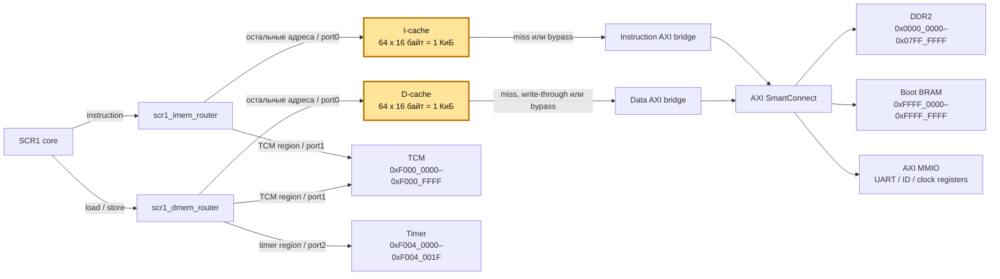

# SCR1 caches

Кэши инструкций и данных для SCR1 для Nexys 4 DDR

## Возможности

- direct-mapped, blocking;   
- последовательное заполнение всей строки словами из памяти;
- синхронные одномерные массивы с `ram_style = "block"` (фактическое размещение лучше смотреть в post-synthesis utilization report);
- I-cache - `SCR1_ICACHE_NUM_LINES` строк по `SCR1_ICACHE_LINE_WORDS` слов по 4 байта;  
- D-cache - `SCR1_DCACHE_NUM_LINES` строк по `SCR1_DCACHE_LINE_WORDS` слов по 4 байта;  
- D-cache: write-through, no-write-allocate, byte-enable для частичных stores;
- Предусмотрен bypass для boot BRAM и внешние MMIO;

> По умолчанию I-cache и D-cache сконфигурированы на 64 строки по 4 слова, то есть 1 КиБ.
> Объём и геометрию кэшей можно настраивать, но `SCR1_ICACHE_LINE_WORDS` и `SCR1_DCACHE_LINE_WORDS` должны быть степенью двойки не меньше 2 для корректной работы.


## Архитектура



## Файлы

| Файл | Назначение |
|---|---|
| [`scr1_icache.sv`](./scr1_icache.sv) | Кэш инструкций |
| [`scr1_dcache.sv`](./scr1_dcache.sv) | Кэш данных |
| [`scr1_cache_wrapper.sv`](./scr1_cache_wrapper.sv) | Общая обёртка и соединение интерфейсов |

Интеграция выполнена в `scr1_top_axi.sv`

## Текущая конфигурация

| Кэш | Строк | Размер строки | Ёмкость данных | Cacheable |
|---|---:|---:|---:|---|
| I-cache | 64 | 16 байт | 1 КиБ | DDR2 `0x0000_0000–0x07FF_FFFF` |
| D-cache | 64 | 16 байт | 1 КиБ | DDR2 `0x0000_0000–0x07FF_FFFF` |

```systemverilog
.ICACHE_ADDR_MASK     (32'hF800_0000),
.ICACHE_ADDR_PATTERN  ('0),
.DCACHE_ADDR_MASK     (32'hF800_0000),
.DCACHE_ADDR_PATTERN  ('0)
```

Маска `0xF800_0000` выбрана специально для кэширования только адресов из DDR - `0x0000_0000–0x07FF_FFFF`.  

Адреса регистров внешних MMIO не были добавлены из-за сложности поддержания актуальности приходящих и уходящих данных с MMIO.  

Адреса TCM не были включены в кэш, т.к. TCM сама по себе является быстрой памятью и обращения происходят за один такт.  

## Политики

I-cache принимает только чтения. При miss он последовательно загружает четыре
слова и выставляет valid бит только после полного заполнения строки.

D-cache обслуживает load hit локально. Каждый store отправляется нижней памяти,
после успешного store hit копия в кэше обновляется через byte-enable, то есть только конкретный байт/полуслово в строке. Store miss не загружает строку.

Массивы data и tag не сбрасываются, reset очищает только valid-биты и состояние FSM. 

## Ограничения

- один запрос одновременно;
- четыре одиночных чтения на fill, без burst и early restart;
- нет ассоциативности, prefetch и write buffer;
- нет аппаратной когерентности I-cache/D-cache/DMA;

## Бенчмарки

Результаты бенчмарков представлены в
[таблице](https://docs.google.com/spreadsheets/d/1Z09Oc5KWd_BYFXryHQR0jsfkYbIVZM1zehx1FCA-16o/edit?usp=sharing).

## Версии  

### cache_1.3 - добавлена инвалидация кэша по инструкции FENCE.I  

> Инструкция `FENCE.I` нужна для синхронизации записей в память инструкций с послежующей выборкой инструкций. То есть она обеспечивает видимость результата для последующих инструкций.  
> На уровне ядра при декодировании инструкции `FENCE.I` IDU выставляет fencei_req = 1'b1, после чего в EXU генерируется событие `exu_queue_vd & exu_queue.fencei_req`, по которому, во первых, сбрасывается очередь в IFU, а во вторых инвалидируется кэш инструкций.

- Был добавлен обработчик `FENCE.I`, который инвалидирует кэш по запросу от EXU с помощью handshake;
- В код загрузчика `scbl.c` был добавлен вызов `fencei()` перед исполнением загруженной программы. Загрузчик был пересобран, теперь актуальным образом является - `scbl_fencei.mem`;  
- Параметры геометрии кэша вынесены в хэдеры `scr1_arch_description.svh` и `scr1_arch_custom.svh` для NEXYS 4 DDR;  

### cache_1.2 - роутеры перед кэшами

- `imem_router` подключён напрямую к instruction-интерфейсу ядра;
- TCM-инструкции уходят с `port1` в TCM, минуя I-cache;
- `dmem_router` подключён напрямую к data-интерфейсу ядра;
- TCM и timer уходят с `port1`/`port2`, минуя D-cache;
- `port0` каждого роутера подключён к кэшу, а нижняя сторона кэша - к AXI;
- I-cache переведён на одну основную пару параметров `ADDR_MASK/ADDR_PATTERN`, общую по смыслу с D-cache;  

### cache_1.0 - базовая версия

Протестированные геометрии кэшей с одной и той же базовой архитектурой:

- `i1k_d1k`;
- `i16k_d1k`;
- `i32k_d1k`;
- `i1k_d4k`;
- `i1k_d16k`;
- `i32k_d16k`.